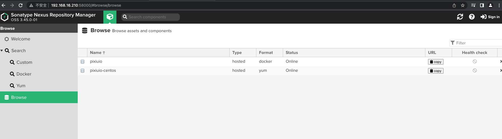

# 离线包准备

### 离线包获取
  ```shell
  USER="ptx9sk7vk7ow:003a1d6132741b195f332b815e8f98c39ecbcc1a"
  URL="https://pixiupkg-generic.pkg.coding.net"

  # 准备 nexus 离线包
  curl -fL -u $USER $URL/pixiu/k8soffline/nexus.tar.gz?version=latest -o nexus.tar.gz
  # 准备 rpm 离线包
  curl -fL -u $USER $URL/pixiu/k8soffline/k8s-v1.23.17-rpm.tar.gz?version=latest -o k8s-v1.23.17-rpm.tar.gz
  # 准备镜像离线包
  curl -fL -u $USER $URL/pixiu/allimagedownload/allimagedownload.tar.gz?version=latest -o k8s-centos7-v1.23.17_images.tar.gz

  # 准备 kubez-ansible 离线包
  curl https://codeload.github.com/gopixiu-io/kubez-ansible-offline/zip/refs/heads/master -o kubez-ansible-offline-master.zip
  ```

### 初始化

#### 启动 `nexus` 服务
1. 启动 `nexus` 服务
  ```shell
  tar -zxvf nexus.tar.gz

  cd  nexus_local/
  sh nexus.sh start

  # 当前时间: 23:20:37 服务启动成功！
  ```

2. 验证
  ```shell
  # 访问nexus
  http://ip:58000   用户名: admin  密码: admin123

  # nexus搭建镜像仓库地址
  http://ip:58001   用户名: admin  密码: admin123
  ```


3. 上传镜像和软件包
  ```shell
  NexusIp=192.168.16.210

  # 切换到离线包同级目录
  cd ~
  tar zxvf k8s-centos7-v1.23.17_images.tar.gz
  cd allimagedownload
  sh load_image.sh $NexusIp

  # 切换到离线包同级目录
  cd ~
  tar zxvf k8s-v1.23.17-rpm.tar.gz
  cd localrepo
  sh push_rpm.sh $NexusIp
  ```

#### 初始化部署节点
1. 拷贝 `kubez-ansible-offline-master.zip` 到部署节点

2. 设置 `yum` 源
```shell
cat > /etc/yum.repos.d/pixiu.repo << EOF
[basenexus]
name=Pixiuio Repository
baseurl=http://192.168.16.210:58000/repository/pixiuio-centos/
enabled=1
gpgcheck=0
EOF

yum clean all && yum makecache
```

3. 安装 `kubez-ansible`
```shell
# 安装依赖包
yum -y install ansible unzip python2-pip
# 解压 kubez-ansible 包
unzip kubez-ansible-offline-master.zip
cd kubez-ansible-offline-master

# 安装依赖的 pbr
pip install pip/pbr-5.11.1-py2.py3-none-any.whl

cp tools/git /usr/local/bin && git init
# 执行安装
python setup.py install
```

4. 验证
```shell
kubez-ansible
Usage: /usr/bin/kubez-ansible COMMAND [options]
```
