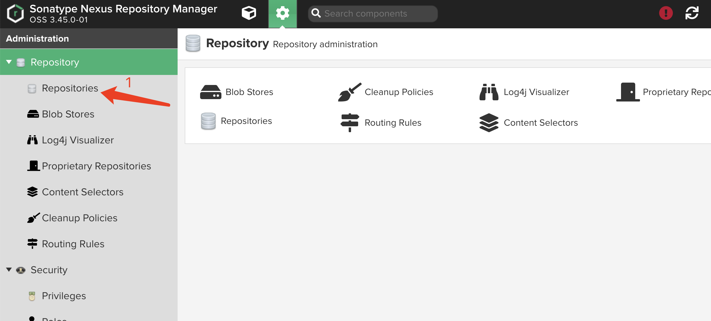
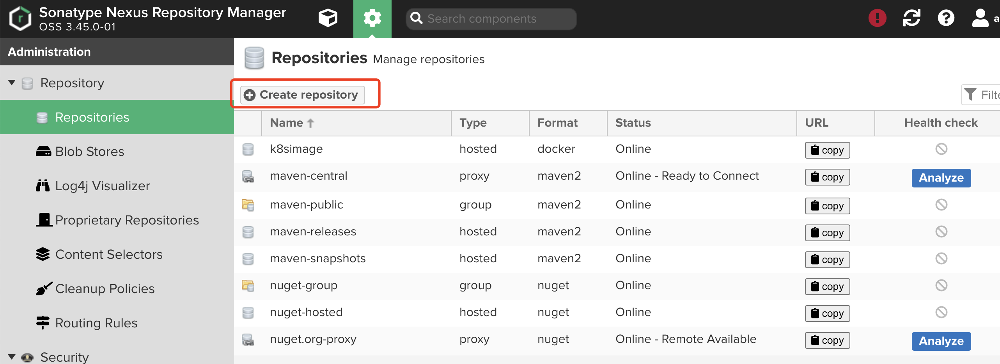
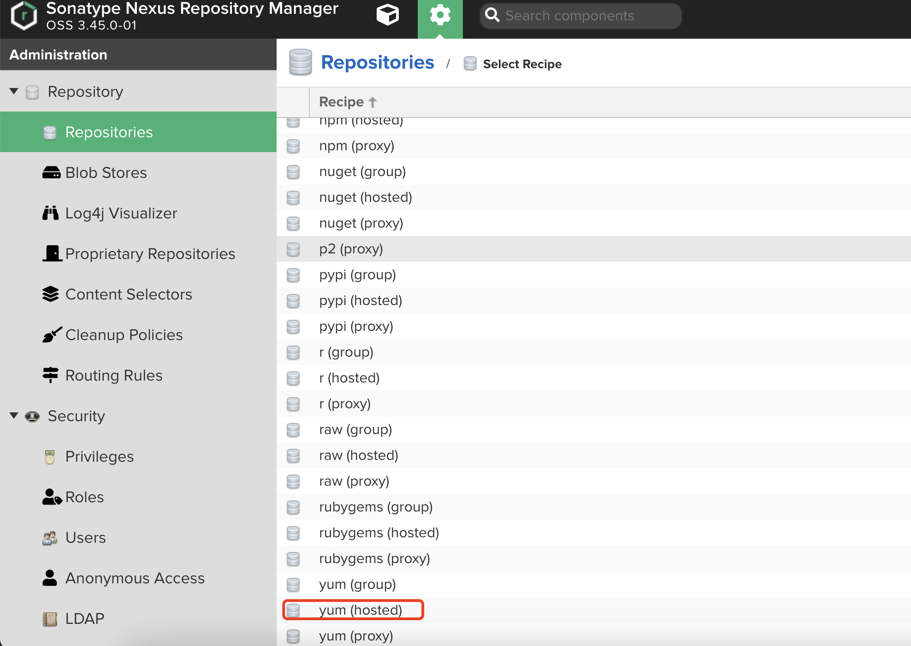
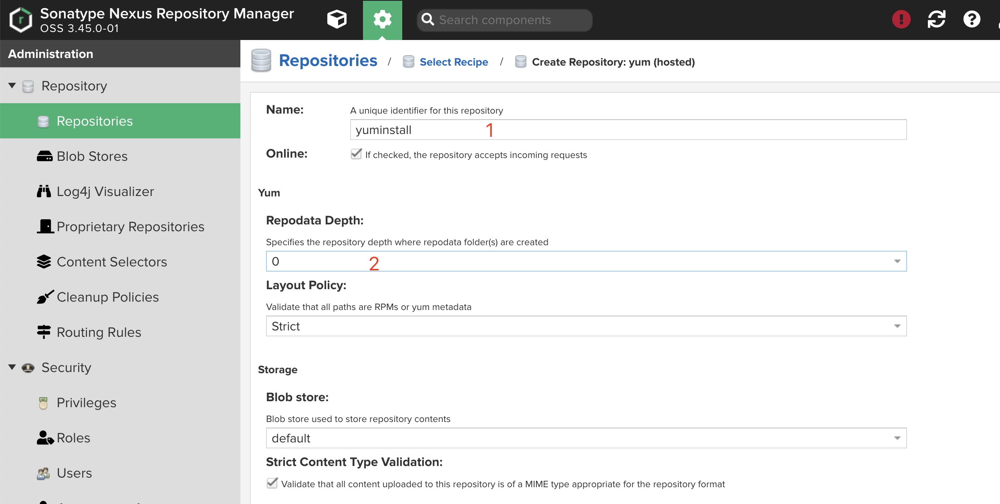

# 使用 kubez-ansible 离线部署 kubernetes
## 一、部署私有镜像仓库

### 部署步骤
1. 安装 `nexus`

   - 解压安装 `nexus`
     ```bash
     解压 "nexus"
     tar -zxvf nexus.tar.gz
     启动 "nexus"
     sh nexus.sh start
     ```

2. 上传镜像和软件包

   - 上传 `images`
     ```bash
     解压镜像包
     tar -zxvf k8s-centos7-v1.23.17_images.tar.gz
     
     修改脚本内容，将 "registry" 内容修改为主机的 IP，端口默认不变
     vim load_image.sh
     # 文件内容
     registry="192.168.17.48:58001"
     
     执行上传镜像脚本 #确保 skopeo 工具可用，后续会将此工具内置进去
     sh load_image.sh
     ```
   - 创建 `yum` 仓库   （后面的 docker 源也是如此操作）
     
     
     
     
   
   - 上传软件包
     ```bash
     解压软件包
     tar  -zxvf rpms.tar.gz 
     创建 yum 仓库

     修改脚本内容，将 "registry" 内容修改为主机的 IP，端口默认不变
     vim load_image.sh
     # 文件内容
     registry="192.168.17.48:58000"

     执行上传脚本
     sh yum_upload.sh
     ```

   - 制作 `yum` 仓库
     ```bash
     创建 pixiu.repo 文件
     [base-kube]
     name=Pixiu
     baseurl=http://192.168.17.48:58000/repository/yuminstall
     enabled=1
     gpgcheck=0
     priority=1

     [base-docker]
     name=Pixiu
     baseurl=http://192.168.17.48:58000/repository/dockerinstall
     enabled=1
     gpgcheck=0
     priority=1

     构建 yum 仓库
     yum clean all
     yum makecache
     ```
## 二、安装 kubez-ansible

1. 下载离线包

   - 解压 kubez-ansible
     ```bash
     解压 "kubez-ansible"
     unzip  kubez-ansible-offline-master.zip  
     ```
   - 安装 pip，安装依赖包
     ```bash
     安装 "pip"
     yum -y install python2-pip

     安装依赖包（后续此包也会内置进去）
     pip install pbr-5.11.1-py2.py3-none-any.whl

     将 git 拷贝到 bin 目录下, init 初始化
     cp tools/git /usr/bin/
     git init

     执行脚本安装kubez-ansible
     python setup.py  install

     测试命令回显
     kubez-ansible

     Usage: /usr/bin/kubez-ansible COMMAND [options]

     Options:
     --inventory, -i <inventory_path>   Specify path to ansible inventory file
     --playbook, -p <playbook_path>     Specify path to ansible playbook file
     ```

## 三、安装 kubernetes 相关组件

1. 修改全局配置文件

   - 拷贝全局配置文件
     ```bash
     cp -r etc/kubez/ /etc
     ```
   - 修改全局配置文件
     ```bash
     vim /etc/kubez/globals.yml

     # 需要修改的内容

     kube_release: 1.23.17                                              # 根据镜像版本修改
     network_interface: "ens192"                                        # 修改为实际的网卡名称
     image_repository: "192.168.17.48:58001/k8simage"                   # 修改为私有镜像仓库的名称
     yum_baseurl: "http://192.168.17.48:58000/repository/yuminstall"    # 修改为私有 yum 仓库的名称
     docker_release: "24.0.4"                                           # 修改为 docker rpm 包的版本
     ```

   - 修改主机组文件（目前只支持 centos7 ）
     ```bash
     vim /usr/share/kubez-ansible/ansible/inventory/all-in-one

      [docker-master]
      localhost       ansible_connection=local

      [docker-node]
      localhost       ansible_connection=local

      [containerd-master]

      [containerd-node]
     ```

   - 开始部署
     ```bash
     # 安装 ansible
     yum -y install  ansible

     # 进行 kubernetes 的依赖安装
     kubez-ansible bootstrap-servers

     # 进行 kubernetes 的集群安装
     kubez-ansible deploy

     # 查看状态
     kubectl  get pod -A
     ```